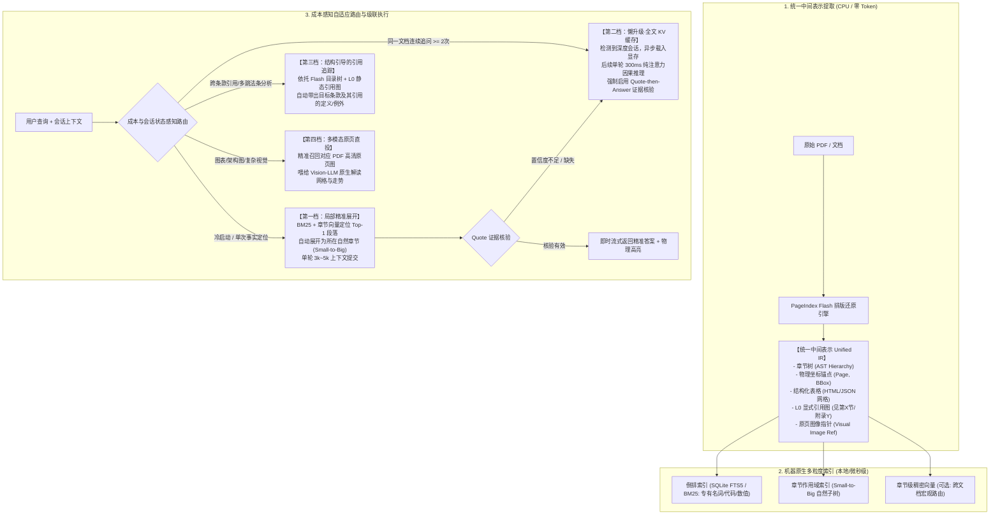

# 机器本位与自适应多级 RAG 架构设计规范
> **面向现代 AI 计算特性的长文档/知识库检索体系重构**

---

## 1. 核心问题意识：从“拟人化陷阱”到“机器本位”

在构建面向复杂文档（PDF、技术规范、教科书、研究报告、研报）的知识检索系统时，行业普遍存在一个隐蔽的**“拟人化陷阱”（Anthropomorphic Fallacy）**：
> *“人类通过看目录、翻页码、跳读章节来查找资料，因此让 LLM 模拟人类翻书阅读，就是最自然、最优秀的方法。”*

从**第一性原理（First Principles）**和**物理计算效率**出发，这一假设混淆了数据本质与计算实现：
1. **数据的不变量（Data Invariant）**：作者在写作时对知识进行的聚类、限定作用域与层级划分（章节、段落、二维表格、交叉引用）。**这层结构是客观的，必须被无损提取**。
2. **人类的检索行为（Algorithm Implementation）**：看目录、跳读、反复翻页。**这只是人脑受限于极小工作记忆（4~7 个 Chunk）和极慢阅读速度（300 词/分）所被迫采取的妥协策略，绝不代表机器的最优计算路径**。

---

## 2. 批判性剖析：三大主流检索模式的真实死穴

为建立理性的架构，必须毫不留情地解构当前三种主流路线的物理局限：

### 2.1 传统切块向量 RAG（Chunk-and-Embed, 2023）
* **机制**：机械切成 300~500 Token 碎片，向量化后靠余弦相似度召回。
* **致命死穴**：
  1. **相似度 ≠ 逻辑相关性（Similarity ≠ Relevance）**：在专业文档中，“原因/前提”往往与“事实描述”在词汇和语义投影空间中距离极远。向量检索只能找到重复提问事实的废话句子，完全无法找寻因果链。
  2. **拓扑割裂**：机械切分肢解了表格、切断了法条的上位除外责任、打散了定义域与正文的联系。

### 2.2 纯树状 Agent 导航（当前 PageIndex 路线）
* **机制**：通过 CPU 提取目录树，让 LLM 充当 Agent：`get_document_structure` 读目录 -> 推断章节 -> `get_page_content` 调取页面 -> 多轮循环。
* **致命死穴**：
  1. **串行 RTT 延迟雪崩**：每走一步都是一次完整的模型推理与网络往返（3~5 轮交互），端到端耗时常达 **10~25 秒**，严重打断用户心流。
  2. **弱目录/暗礁盲枝裁剪**：大量真实文档目录极其粗糙（如 200 页合同只有“一、总则 ... 十、附则”）。关键豁免条款藏在第 180 页小字里时，目录层完全不可见，Agent 必定误判剪枝（Pruning Failure），导致漏检率 100%。
  3. **预处理成本暗度陈仓**：为了让目录推理准确，建库时需要对每层树节点生成 Summary（实测 222 页文档需发起 **182 次 LLM 调用**），构建期极其沉重且昂贵。

### 2.3 盲信长上下文直读（Naive Full-Context Caching）
* **机制**：把 200~300 页文档全部丢进 1M 上下文模型，依托 Prompt Caching 全量直读。
* **致命死穴**：
  1. **单次查询成本血亏**：Prompt Caching 需要多轮查询才能摊销写入成本。若用户“问一个问题就走”，20 万 Token 的 Prefill 成本是局部检索的 **40 倍以上**。
  2. **注意力稀释与多跳衰减（Lost in the Middle）**：在 20 万 Token 全文中，单点事实易搜，但跨越数十页的严密数学对账与多跳因果推导，模型受背景噪音干扰，推理准确度显著低于精炼上下文。
  3. **私有化显存暴毙**：70B 模型每 20 万 Token 的 KV Cache 需独占 **~60GB 显存**，高并发场景下显存迅速耗尽。

---

## 3. 真实账本：成本模型与硬件物理边界

### 3.1 Token 成本与交互深度（$N$）的盈亏平衡推演
以当前主流 API 定价当量估算（缓存写入 1.25x 溢价，命中读取 0.1x）：

| 模式 | 首次查询（冷启动） | 后续每次查询（热缓存） | 单次即走 ($N=1$) | 连续交互 ($N=5$) |
| :--- | :--- | :--- | :--- | :--- |
| **全文 Prompt Caching（20万 Token）** | ~25 万当量 | ~2 万当量 | **25 万 (极贵)** | **33 万 (回本)** |
| **PageIndex 树状 Agent** | 5 轮 × 1.5 万 = **7.5 万** | 5 轮 × 1.5 万 = **7.5 万** | **7.5 万** | **37.5 万** |
| **局部精准 RAG（Small-to-Big）** | **~0.6 万当量** | **~0.6 万当量** | **0.6 万 (极廉)** | **3.0 万 (总成本最低)** |

* **盈亏临界点**：
  - 对比树状 Agent：$25 + 2(N-1) < 7.5N \implies N \ge 4.4$。即**同一文档在几十分钟 TTL 内连续提问 5 次以上，全文缓存才在成本上优于树状 Agent**。
  - 对比局部精准 RAG：全文缓存哪怕全部命中，每次交互成本（2 万）依然是局部精准 RAG（0.6 万）的 3 倍以上。全文缓存**无法赢在纯 Token 账上，只能赢在推理质量与单轮流式体验上**。

### 3.2 企业多租户与权限（ACL）的物理冲突
* **缓存前提**：Prompt Caching 要求**请求前缀逐字节完全一致**。
* **企业现实**：多租户环境下，每个员工的文档可见范围（ACL）不同，文档前缀无法全局共享，导致公共缓存池命中率骤降至零。ACL 过滤必须在**物理检索阶段（Pre-filter）**完成。

---

## 4. 终极自适应架构：成本感知与级联升级（Adaptive Cascaded RAG）

不再固步自封于“用不用向量库”或“全不全量直读”，架构以 **“统一中间表示（IR）为地基，成本-意图驱动路由，失败级联升级”** 为原则。

### 核心机制细则：
1. **统一中间表示（Unified IR）**：利用 PageIndex Flash 优秀的 CPU 能力，一次解析生成结构树、表格、引用网络与物理 BBox，下游所有模式共享同一数据底座。
2. **懒缓存升级（Lazy Caching）**：第一次提问默认走极廉价的 Tier 1（几百 Token 开销、毫秒级响应）；一旦用户对该文档产生第 2 次交互，系统判定进入深度学习模式，后台自动触发 KV Cache 装载，无缝升级到全局因果注意力体验。
3. **强引用约束（Quote-then-Answer）**：全文模式下，强制模型必须在 `<quote>` 标签内一字不差地引用原文证据，服务端进行即时字符串匹配；若匹配失败（幻觉），立即触发级联报警或降级。

---

## 5. 实战检验：在真实个人学习资料库中的对比与优劣

以常见的个人学习环境（例如 `E:\me\Documents\学习资料`，包含教科书、开发手册、论文、考试资料、PPT 讲义等数百份混合资料）为例，对比当前工程（PageIndex）与本架构的真实工程表现：

### 5.1 场景特征与痛点剖析
1. **资料异构性极强**：既有几千页的《Linux 内核源码剖析》、《Go 语言规范》，也有几十页的双栏 IEEE 论文，还有大量无目录的 PPT 课件、代码实验笔记。
2. **提问意图跨度极大**：
   - *快查型*：“Kubernetes Pod 亲和性的配置参数叫什么？”（单次、需要 1 秒内出结果）；
   - *研读型*：“对比第 3 章和第 7 章关于分布式事务 2PC 与 TCC 的实现差异，结合文档分析优劣”（跨章节、长程对比、连续多轮追问）；
   - *全局跨库型*：“我这几十本书里，哪几本详细讲了 epoll 的边缘触发机制？”（跨文档检索）。

### 5.2 综合优缺点对照矩阵

| 评估维度 | 当前工程（PageIndex 原版纯树 Agent） | 本规范方案（自适应多级 RAG） |
| :--- | :--- | :--- |
| **跨文档宏观检索能力** *(“哪份资料讲了 X？”)* | **极弱 / 几乎不可用** 无法同时跨 50 本书搜索，只能让 Agent 逐一浏览文件名猜测，效率极低。 | **极优** 通过本地 SQLite FTS5 + 宏观语义索引，毫秒级定位出讲到该技术点的 2~3 本书，并锁定章节。 |
| **快查单点问题体验** *(“参数名/函数名是什么？”)* | **较差** 强制走 Agent 循环：读目录 -> 调页面，回答一个简单问题需等 8~15 秒。 | **极致流畅** 直接命中倒排/Small-to-Big，0.8 秒单轮流式吐出答案，体验接近 本地 Grep。 |
| **无目录资料（PPT/讲义/笔记）** | **严重退化 / 失效** 无目录时 `get_document_structure` 只有平铺页面，Agent 只能瞎猜或顺序暴力翻页。 | **稳健可靠** 无目录时自动平滑走滑动窗口与语义子树展开，不依赖作者是否手写目录。 |
| **单本大作深度研读** *(连续问 20 个深层问题)* | **中等** 每次提问都要重复 3~5 轮 Agent 翻书，虽然能定位，但每轮都有延迟和剪枝误判风险。 | **降维打击** 第 1 问后自动激活 Lazy KV Cache，后续 19 问直接在 GPU 显存内做全局 Attention 推理，单轮 300ms 响应，因果关联无死角。 |
| **跨章节严密对比** *(“第 4 章与第 8 章区别”)* | **良好** 如果目录清晰，Agent 可以分别调用两处的 `get_page_content` 组合回答。 | **极佳** 依托 L0 引用图或显存缓存直读，自动将两部分完整上下文单轮并置输入，无碎片感。 |
| **视觉图表与公式** *(流程图、走势折线图)* | **丢失** Flash 提取丢弃图形，遇到架构图只能回答“文本中未提及”。 | **多模态原页直补** 命中视觉密集型页面时，直接透传原页渲染图给 Vision-LLM 解读。 |
| **系统构建与维护成本** | **构建期昂贵** 纯 CPU 提取快，但生成树摘要（Node Summaries）需要大量 LLM API 调用。 | **纯本地极轻** 构建期完全由本地 CPU 搞定排版、BBox 与倒排，无需预先做昂贵的全书摘要。 |

---

## 6. 演进路线建议

1. **第一步（保护核心资产）**：将 PageIndex Flash 确立为项目的**“黄金通用解析层（IR）”**，负责输出带物理坐标、章节树与引用关系的纯净 Markdown。
2. **第二步（废黜唯一的 Agent 翻书机制）**：将当前单一的 Agent 循环降级为“多跳场景专用路由”，引入基于 SQLite FTS5 的即时倒排与 Small-to-Big 自然子树展开。
3. **第三步（接入现代缓存体系）**：在 Client 侧集成对各大模型厂商（或本地 vLLM/SGLang）Prompt Caching 的原生支持，实现“会话感知懒升级”。
4. **第四步（多模态兜底）**：利用 Flash 已具备的 PDFium 原生渲染能力，在检测到复杂图表块时，一键切出局部原页图像，彻底解决自然语言无法描述复杂架构图的顽疾。
