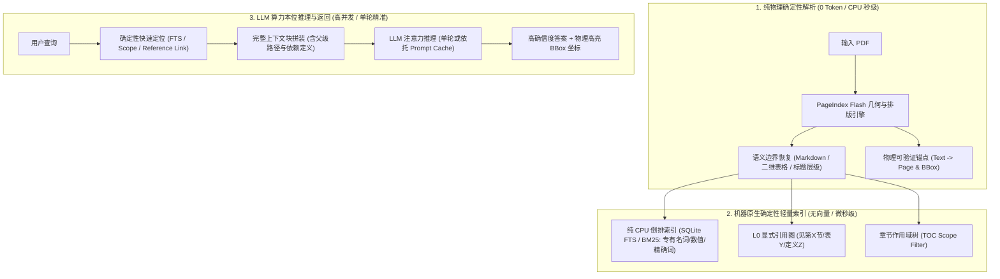

# 机器本位与第一性原理：长文档检索机制深度剖析

---

## 1. 核心问题与第一性原理

在探索长文档（PDF/研报/合同/技术规范）智能检索时，整个行业普遍存在一个隐蔽的**“拟人化陷阱”（Anthropomorphic Fallacy）**：
> “人类是通过看目录、翻页码、顺着章节找内容，因此让 LLM 像人一样翻书阅读就是最自然、最高效的方式。”

从**第一性原理（First Principles）**和**物理计算效率**出发，这一假设在工程上是站不住脚的。必须明确区分两件事：
1. **文档的内容拓扑结构（Data Invariant）**：作者对思想进行的聚类与作用域划分（章节、段落、表格、引用）。这是数据本身的客观结构，**必须被精准还原**。
2. **人类的检索行为（Algorithm Implementation）**：看目录、跳读、顺着引用反复翻页。这是人类受限于生理硬件缺陷所采取的妥协策略，**绝对不等于机器的最优计算路径**。

---

## 2. 人脑生物学缺陷 vs LLM/硬件计算特征

| 维度 | 人类大脑（生物学算力） | 现代 LLM + 硬件（硅基算力） |
| :--- | :--- | :--- |
| **工作记忆容量** | 极小（Miller's Law: 4~7 个信息块） | 极大（128k ~ 1M+ Token 上下文） |
| **扫描与吞吐带宽** | 极慢（约 200~400 词/分钟） | 极快（GPU Prefill 阶段每秒并行吞吐数十万 Token） |
| **寻址模式** | **串行指针寻址**（顺着目录找章节、翻页定位） | **全局并行内容寻址（Content-Addressable Multi-Head Attention）** |
| **遍历代价** | 低能耗、串行、易疲劳、易遗漏 | 串行 Agent 交互极其昂贵（多轮 RTT 延迟与级联错误放大） |
| **跨区域关联** | 极差（翻到第 50 页往往遗忘第 3 页定义） | 极强（注意力矩阵在所有输入 Token 之间同时做软关联 Soft-Join） |

### 2.1 为什么“像人一样多轮翻书”对 LLM 是低效的？
很多“仿人检索 Agent”（例如：LLM 读目录 -> 决定调 Tool 看某章 -> 读小节摘要 -> 发现没有再回溯）在工程上有致命缺陷：
1. **网络与调度延迟灾难**：机器每翻一步，都要经历一次完整的模型推理与网络往返（RTT）。一次 3~5 步的目录寻径耗时高达 10~30 秒。
2. **决策级联崩溃（Fragile Pruning）**：真实文档的目录命名常常模糊甚至反直觉（例如某关键指标的定义被塞在“附录 C 释义”或某章的脚注中）。LLM 在根目录决策一旦误判剪枝，整个检索直接进入死胡同。
3. **元调度 Token 浪费**：每一轮 Agent 决策都伴随庞大的 System Prompt 和工具描述 Schema，耗费大量无意义算力。

---

## 3. 彻底澄清：关于“向量数据库（Vector DB）”的客观评判

在传统 RAG 中，向量数据库几乎成了行业“肌肉记忆”，但**在以高精度、长文档为核心的工程（如 PageIndex）中，强行引入向量数据库在第一性原理上是错误的**。

### 3.1 为什么 PageIndex 坚持“不用向量数据库（Vectorless）”是完全正确的？

1. **“语义相似度 ≠ 逻辑相关性”（Similarity ≠ Relevance）**
   - 向量检索的核心假设是“余弦距离近 = 内容相关”。但在专业文档（财报 10-K、法律合同、技术规约）中，这往往失效：
     - *提问*：“第三季度净利润下滑的核心原因是什么？”
     - *向量库召回*：“第三季度净利润下滑 15%”（字面与语义最相似，但完全不含原因，属于废话）。
     - *真正原因*：“受红海航运受阻及海外关税调整影响，欧洲区物流成本上涨 32%”（字面毫无‘净利润’词汇，向量相似度低，但这是真正的因果答案）。
   - **相关性需要推理（Reasoning），而不是粗暴的向量投影。**

2. **分块切割（Chunking）对拓扑的毁灭性打击**
   - 向量数据库的前提是把文档切成 300~1000 Token 的碎片（Chunk）。
   - 这种机械切分会割裂表格上下文、切断条款与母章节的限定条件、打散定义与使用的关联。

3. **长上下文与 KV Cache（Prompt Caching）对局部向量库的降维打击**
   - 向量库盛行于 2022~2023 年（当时模型窗口仅 4k~8k），不得不依赖向量库作为外挂临时内存。
   - 当代前沿模型支持数十万到上百万 Token 的上下文窗口，且普遍支持 **Prompt Caching（前缀 KV 缓存）**。
   - 一份 300 页的专业 PDF 提取为纯净文本约 15~25 万 Token。**将其结构化文本整体缓存到显存后，后续所有查询直接基于 KV Cache 执行注意力检索**：
     - 此时，Transformer 的多头注意力机制（Multi-Head Attention）本身就是一个超高精度的、具备上下文动态调权的“神经向量检索机”；
     - 它彻底碾压了传统向量库的静态单向量（Single Embedding）点积。

4. **轻量与运维边界**
   - 部署 Milvus / Qdrant / Pinecone 等向量库需要重型服务、Embedding 模型管线以及复杂的索引重建过程；这与 PageIndex 追求的轻量、确定性、甚至能在嵌入式/本地环境运行的基础设施定位完全背道而驰。

---

## 4. 机器本位的“无向量库（Vectorless）”高效实现路径

如果既不采用低效的“仿人串行多轮翻书”，又不采用脆弱的“外挂向量数据库”，最高效的落地形态应该是什么？

### 核心分工原则：

1. **解析端（发挥 CPU 确定性优势）**：
   - 依赖 PageIndex Flash：使用纯 CPU、0 Token 恢复段落完整性、跨列排版、表格网格和章节层级，并给每个元素打上精确的 `(page_index, bbox)` 物理锚点。
2. **过滤端（发挥确定性数据结构优势，彻底告别向量库）**：
   - **倒排索引（FTS / BM25）**：利用内置的 SQLite FTS 或纯 Python 倒排，解决 100% 的专有名词、财务数值、法条编号等硬匹配。无需任何外部向量服务，微秒级返回。
   - **引用网络（L0 Reference Linker）**：当命中第 4 节时，基于静态正则与目录哈希，把其引用的“第 1.2 节定义”直接打包召回。
3. **推理端（发挥 LLM 并行注意力与因果推理优势）**：
   - 将结构完整的章节上下文（而非切碎的 Chunk）单轮喂入 LLM；
   - 结合 Prompt Caching 技术，实现百毫秒级的深度阅读与回答生成；
   - 最终返回带有底层物理坐标的精准高亮答案，完成完整闭环。

---

## 5. 总结

- **不要让机器东施效颦人类的生物缺陷**：人类翻目录是因为记不住，LLM 不需要“翻书”；
- **坚守 Vectorless 的核心护城河**：不用向量数据库不是落后，而是在深刻理解了“相似度 ≠ 相关性”之后的正确选择；
- **守住确定的，做好推理的**：用 CPU 搞定几何、排版与倒排；用 LLM 的注意力搞定因果、归纳与解答。
