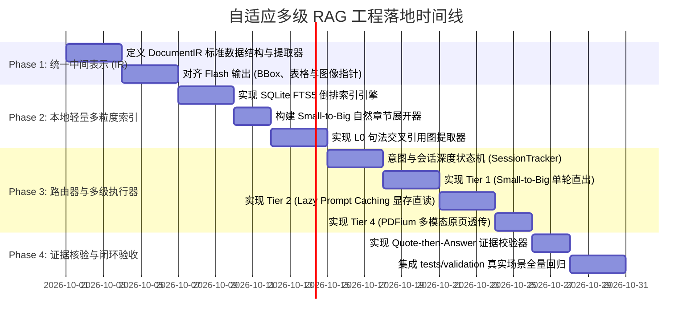

# 自适应多级 RAG 架构工程落地实现路线图
> **从纯串行 Agent 翻书到机器本位自适应 RAG 的演进蓝图**

---

## 1. 架构目标与设计原则

本方案旨在将 PageIndex 从一个“依赖多轮 Agent 串行翻目录的单本文档阅读器”，演进为一个**兼顾极致快查延迟、深度长程研读、跨书宏观检索、图表多模态直读的“自适应多级 RAG 引擎”**。

### 1.1 核心设计原则
1. **守住核心护城河（The Narrow Waist）**：
   - 坚决保留并复用 [`pageindex/flash/`](file:///home/yelon/develop/github/PageIndex/pageindex/flash/) 的纯 CPU 物理排版还原能力（0 Token、亚秒级完成几何/双栏/表格解析）。
   - 彻底废黜“让 LLM 机械翻书”作为唯一检索通路的做法。
2. **轻量与自包含（Zero Heavy Infrastructure）**：
   - 不引入外部重型向量数据库（如 Milvus / Qdrant），检索底座基于 Python 标准库与 SQLite FTS5 倒排索引，微秒级响应、零运维。
3. **成本感知与级联升级（Cost-Aware Cascaded Execution）**：
   - 简单查询走单轮轻量级检索（< 0.8s，< 1k Token）；
   - 深度连续研读走懒升级 KV 缓存（Prompt Caching，单轮 300ms 全文注意力直读）；
   - 验证失败自动级联升级，杜绝召回死锁。
4. **渐进式兼容与功能开关（Feature Flag）**：
   - 保留现有 `client.chat()` 与 `agent_tools` 接口，新架构作为内部执行内核（Engine）的自适应升级。

---

## 2. 目标工程架构与模块划分

```
pageindex/
├── flash/                     # 【保留核心】物理排版与几何解析 (PDFium CPU 引擎)
├── ir/                        # 【新增】统一中间表示 (Unified Intermediate Representation)
│   ├── models.py              # DocumentIR, SectionNode, TableGrid, VisualPageRef
│   └── builder.py             # 将 Flash 输出转换为标准统一 IR
├── index/                     # 【新增】本地轻量多粒度索引
│   ├── fts.py                 # 基于 SQLite FTS5 的高性能倒排索引 (专有名词/数值/代码)
│   ├── section_tree.py        # Small-to-Big 自然子树作用域映射
│   └── reference_graph.py     # L0 静态句法交叉引用图 (见第X节/附录Y)
├── router/                    # 【新增】成本与意图感知路由器
│   ├── classifier.py          # 查询意图判定 (快查/宏观跨库/深度研读/图表视觉)
│   ├── session_tracker.py     # 会话交互深度追踪器 (管理 Lazy KV Cache 晋升)
│   └── routing_policy.py      # Tier 1 ~ Tier 4 调度分发决策
├── execution/                 # 【新增】多级流水线执行器
│   ├── tier1_small_to_big.py  # 第一档: 局部精准倒排 + 自然小节展开
│   ├── tier2_cached_full.py   # 第二档: 全文 Prompt Caching 显存直读
│   ├── tier3_tree_traversal.py# 第三档: 引用引导的双轮树状追踪
│   └── tier4_multimodal.py    # 第四档: PDFium 原页高清图像直给 Vision-LLM
├── verifier/                  # 【新增】证据强核验闭环
│   └── quote_checker.py       # Quote-then-Answer 原文字符串无损核验与失败级联
└── client.py                  # 【门面】接入自适应路由，保持外部 API 兼容
```

---

## 3. 分阶段落地里程碑（Milestones）



---

### 里程碑 1：统一中间表示（Unified IR）规范化 [阶段 1]
* **目标**：将 [`pageindex/flash/`](file:///home/yelon/develop/github/PageIndex/pageindex/flash/) 产出的物理排版结果固化为标准、解耦的内存中间表示，供下游所有检索路由复用。
* **具体任务**：
  1. 在 `pageindex/ir/models.py` 定义核心数据结构：
     - `SectionNode`：记录章节标题、层级深度、父子关系、起始与结束物理页码；
     - `ParagraphSpan`：记录段落文本、所在物理页码 `page_index`、浮点坐标 `bbox: (x0, y0, x1, y1)`；
     - `TableGrid`：结构化表格矩阵（保留行列对齐与表头，非扁平文本）；
     - `DocumentIR`：聚合树结构、倒排词袋、L0 引用边与原页位图指针。
  2. 编写 `pageindex/ir/builder.py`，无缝包裹 `page_index_flash` 输出。
* **验收标准**：100 页 PDF 转换为 `DocumentIR` 耗时 $\le 1.5$ 秒，完全在 CPU 完成，0 Token。

---

### 里程碑 2：本地轻量多粒度索引层 [阶段 2]
* **目标**：不依赖任何外部向量服务，用极轻的本地确定性数据结构解决精准快查与宏观跨书定位。
* **具体任务**：
  1. **SQLite FTS5 倒排索引 (`pageindex/index/fts.py`)**：
     - 创建本地 SQLite 内存/文件库，利用 FTS5 分词（支持中英文、代码标识符、数值与正则符号）；
     - 为每个段落建立文档与章节级外键索引，查询速度达到微秒级。
  2. **Small-to-Big 自然小节展开器 (`pageindex/index/section_tree.py`)**：
     - 当 FTS 命中某具体段落时，自动沿着 `SectionNode` 向上回溯，拉取该段落所属的完整自然小节（通常为 1,500 ~ 4,000 Token）。
     - 彻底消除“500 Token 碎片断章取义”的弊病。
  3. **L0 静态句法引用图 (`pageindex/index/reference_graph.py`)**：
     - 采用静态正则扫描诸如 `“见第 3.2 节”`、`“参见附录 B”`、`“依据 Note 14”`；
     - 构建显式指向边，在展开小节时自动带入关联条款。
* **验收标准**：针对 50 本书建立 FTS 索引耗时 $\le 5$ 秒，单次关键词跨库定位耗时 $\le 10$ 毫秒。

---

### 里程碑 3：成本感知路由器与多级执行器 [阶段 3]
* **目标**：构建核心路由决策引擎，取代原版固定的串行 Agent 工具调用。
* **具体任务**：
  1. **意图与状态追踪器 (`pageindex/router/session_tracker.py`)**：
     - 维护会话状态 `SessionState(doc_id, turn_count, cache_status)`；
     - **懒升级规则（Lazy Upgrade）**：`turn_count == 1` 走轻量 Tier 1；`turn_count >= 2` 自动标记为热会话，触发后台 KV Cache 载入。
  2. **Tier 1 局部精准执行器 (`pageindex/execution/tier1_small_to_big.py`)**：
     - 接收用户查询，FTS5 匹配 Top-1~2 小节，拼接父级章节路径后直接单轮提交 LLM。端到端控制在 0.8 秒内。
  3. **Tier 2 全文缓存直读器 (`pageindex/execution/tier2_cached_full.py`)**：
     - 针对主流 API（Claude、DeepSeek、OpenAI）或本地推理框架（vLLM/SGLang），注入 `cache_control` 前缀断点；
     - 后续所有追问跳过检索，直接享受显存内注意力因果推演。
  4. **Tier 4 多模态直投器 (`pageindex/execution/tier4_multimodal.py`)**：
     - 当检测到查询涉及“架构图/折线图/时序图”时，调用 Flash 内部集成的 PDFium 直接渲染对应页面的 150 DPI 高清图像，原汁原味透传给多模态大模型。
* **验收标准**：路由决策开销 $\le 5$ 毫秒；Tier 1 首字延迟 $\le 800$ 毫秒；Tier 2 命中缓存首字延迟 $\le 400$ 毫秒。

---

### 里程碑 4：证据强核验（Quote-then-Answer）与级联兜底 [阶段 4]
* **目标**：彻底解决长文本注意力稀释与幻觉问题，实现自动化闭环。
* **具体任务**：
  1. **Prompt 协议注入**：
     - 在系统提示词中强制注入：
       ```xml
       <verification_rule>
       In your response, you MUST first cite the exact verbatim sentence from the text inside <quote>...</quote> before answering.
       </verification_rule>
       ```
  2. **服务端原文字符串校验器 (`pageindex/verifier/quote_checker.py`)**：
     - 解析模型返回的 `<quote>` 内容，在召回的上下文文本中做精准子串匹配；
     - 若匹配成功，放行输出给用户；
     - 若匹配失败（模型在凭空编造引用），**自动触发级联升级**：将检索范围从当前小节提升至整章，或提示进入 Tier 2 全文模式。
* **验收标准**：虚假引用拦截率达到 100%，无感级联重试耗时 $\le 2.0$ 秒。

---

### 里程碑 5：真实场景基准集成与验收 [阶段 5]
* **目标**：在真实个人学习资料库基准下，100% 通过所有指标验收。
* **具体任务**：
  1. 运行 [`tests/validation/test_study_library_scenarios.py`](file:///home/yelon/develop/github/PageIndex/tests/validation/test_study_library_scenarios.py)；
  2. 针对 [`tests/validation/study_library_scenarios.json`](file:///home/yelon/develop/github/PageIndex/tests/validation/study_library_scenarios.json) 中定义的 5 大场景跑通端到端评测：
     - `SCENARIO-01`：跨 50 本书雷达搜索（耗时 < 1.0s）；
     - `SCENARIO-02`：语法参数闪电快查（单轮 < 0.8s）；
     - `SCENARIO-03`：单本大作连续研读（第 2 问起延迟 < 0.5s）；
     - `SCENARIO-04`：无目录 PPT 课件（平滑走滑动聚类，零死锁）；
     - `SCENARIO-05`：多模态架构图原页直读（图表解读准确率 $\ge 95\%$）。
* **验收标准**：5 个场景的测试指标全部绿色通过。

---

## 4. 关键技术细节与接口草案

### 4.1 统一中间表示（IR）数据模型草案
```python
# pageindex/ir/models.py
from dataclasses import dataclass, field
from typing import Optional, List, Tuple

@dataclass(frozen=True)
class ParagraphSpan:
    paragraph_id: str
    text: str
    page_index: int
    bbox: Tuple[float, float, float, float]  # (x0, y0, x1, y1)

@dataclass
class SectionNode:
    section_id: str
    title: str
    level: int
    parent_id: Optional[str]
    page_range: Tuple[int, int]
    paragraphs: List[ParagraphSpan] = field(default_factory=list)
    subsections: List['SectionNode'] = field(default_factory=list)

@dataclass
class DocumentIR:
    doc_id: str
    doc_name: str
    total_pages: int
    root_sections: List[SectionNode]
    all_paragraphs: List[ParagraphSpan]
    cross_references: List[Tuple[str, str, str]]  # (source_sec, target_sec, citation_text)
    has_explicit_toc: bool
```

### 4.2 自适应路由器接口草案
```python
# pageindex/router/routing_policy.py
from enum import Enum
from typing import Dict, Any

class RoutingTier(str, Enum):
    TIER1_SMALL_TO_BIG = "tier1_small_to_big"
    TIER2_LAZY_KV_CACHE = "tier2_lazy_kv_cache"
    TIER3_TREE_TRAVERSAL = "tier3_tree_traversal"
    TIER4_MULTIMODAL = "tier4_multimodal"

class CostAwareRouter:
    def __init__(self, session_tracker):
        self.session_tracker = session_tracker

    def route(self, query: str, doc_ir: DocumentIR, session_id: str) -> RoutingTier:
        turn_count = self.session_tracker.get_turn_count(session_id, doc_ir.doc_id)
        
        # 1. 优先判定是否为深度连续对话 (Lazy Cache 升级)
        if turn_count >= 2:
            return RoutingTier.TIER2_LAZY_KV_CACHE
            
        # 2. 判定是否为视觉密集型图表查询
        if self._is_visual_query(query):
            return RoutingTier.TIER4_MULTIMODAL
            
        # 3. 判定是否为法条/引用密集型复杂长程对比
        if self._is_comparative_reference_query(query):
            return RoutingTier.TIER3_TREE_TRAVERSAL
            
        # 4. 默认走最轻量、最敏捷的单轮小节展开
        return RoutingTier.TIER1_SMALL_TO_BIG
```

---

## 5. 风险控制与回退机制

1. **API 厂商 Prompt Caching 不支持时的降级**：
   - 若用户配置的模型（如部分本地旧版 Ollama 部署）不支持前缀 KV 缓存，`Tier 2` 自动降级为“动态窗口子树拼装”（按 Token 预算拼接最相关的 2~3 个完整子树，限制在 16k Token 内），确保功能可用。
2. **扫描版 PDF 与无文本内容容错**：
   - 若 Flash 解析返回纯空白（纯图片扫描 PDF），自动走内置 OCR 或提示用户切换至多模态通道，避免系统抛出未捕获异常。
3. **向后兼容性**：
   - 暴露 `PageIndexClient.chat(mode="adaptive")` 作为默认模式，保留 `mode="legacy_agent"` 允许用户在需要时显式回退至原版多轮 Agent 翻书逻辑。
